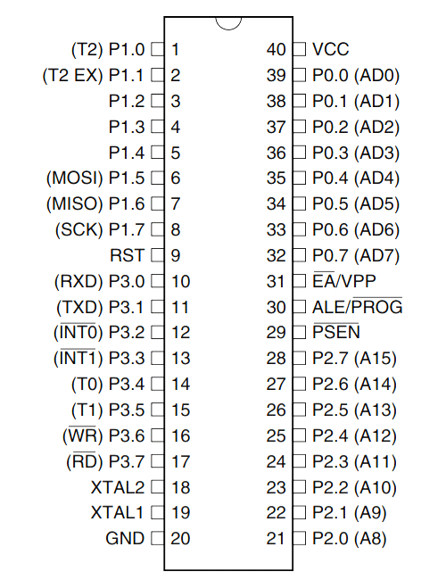

# 8051 汇编学习

看的书：《51 单片机自学笔记》，很老的书了，写得挺好的，不过使用的是 keli 语法。

[TOC]

## Linux 编译环境搭建

我已经很久不用 windows 写代码了，于是决定使用跨平台的 sdcc/platformio，在 linux 上写汇编。

使用基于 [platformio](https://github.com/platformio) 的开源跨平台嵌入式 IDE 开发环境。

platformio 是一个 VSCode 插件，所以先安装好 VSCode，然后直接在插件市场搜索 platformio 安装即可。

安装完成后，在侧边栏的下方就能看到一个蚂蚁头像，点击它即可进入 PlatformIO。

在创建工程的页面，PlatformIO 有提供几乎所有主流单片机平台可选，我个人目前接触到的只有 ESP32、ESP8266、Intel MSC-51(8051) 这三个平台。

创建工程时直接搜索选择 8051，platformio 会自动下载对应平台的编译调试工具链（建议使用全局代理），然后就可以玩耍啦。

### Linux 环境特定的配置

对于 Linux 环境，需要将当前用户加入到对应的序列端口读写相关的 group 中，否则浏览器或 platformio 都没权限读写 serial port.

详见：[udev-rules and groups for platformio](https://docs.platformio.org/en/latest/core/installation/udev-rules.html)

udev-rules 的配置方法请直接参考上面的链接。
group 的添加方法我简单摘抄如下，对于 arch 用户，需要执行：

```shell
sudo usermod -a -G uucp $USER
sudo usermod -a -G lock $USER
```

对于 debian/ubuntu 用户，需要执行：

```shell
sudo usermod -a -G dialout $USER
sudo usermod -a -G plugdev $USER
```

## keli 与 sdcc 的汇编兼容问题

与 keli 不同，sdcc/platformio 的汇编带了挺多 .area 相关的内容，不然编译会出问题。

这部分内容比较复杂，简单起见我直接写了个最简 c 函数编译得到了 sdcc 的 asm 模版，然后在这个模板的基础上改自己的代码...
中间遇到的一些 keli 伪指令，也是一样的玩法，参考了摇摇棒代码生成的汇编，找到了对应的 sdcc 伪指令写法。

platformio 的自动上传指令有错（详见 [platform-intel_mcs51/issues/47](https://github.com/platformio/platform-intel_mcs51/issues/47)），手动上传命令：

```
stcgal -P stc89 -p /dev/ttyUSB0 -t 11059 .pio/build/Generic8051/firmware.hex
```

我没买啥开发版，是直接玩之前买的摇摇棒电路板，用上面的指令上传固件时需要通过手动插拔电路板的 vcc 引脚线实现芯片复位。

另外还使用了 chatgpt 当汇编指令参考手册用，非常方便：


## 1. 控制 LED 灯

### 1.1 单个 LED 灯闪烁

51 单片机自学笔记的第一个汇编程序，改造成 sdcc 兼容格式后内容为（省略掉了 sdcc 的 asm 模板内容）：

```assembly
; ......省略若干 sdcc 的模板汇编内容
;--------------------------------------------------------
;	 function main
;--------------------------------------------------------
_main:
	ar7 = 0x07
	ar6 = 0x06
	ar5 = 0x05
	ar4 = 0x04
	ar3 = 0x03
	ar2 = 0x02
	ar1 = 0x01
	ar0 = 0x00
;--------------------------------------------------------
;	 我们的自定义程序内容由此开始，前面的都是 sdcc 模板内容
;--------------------------------------------------------
    ; 单片机默认会给堆栈分配一个起始地址为 07H，而内存 RAM 中的 07H 这个地方是第 0 组工作寄存器 R7 的空间
    ; 如果你既用了工作寄存器又向堆栈中存储数据，这样在一个地方存放不同的数据，就会导致一些数据被覆盖，从而导致程序莫名其妙的不正常
    ; 在手写汇编时为了避免错误，通常在初始化阶段使用如下命令手动将堆栈指针移动到 0x60
    ; 注意 #0x60 表示这个字面量数字，而如果去掉 # 则表示 RAM 对应地址存放的值
    mov sp, #0x60
_main_loop:
	clr     _P0_0       ; P0.0 置低电平，灯亮
    mov 0x40, #0x02
	; call/scall 都仅能用于跳转到当前代码块的 label，为了跳转到外部代码块，这里必须用 lcall
	; lcall 的工作方式：首先将程序计数器 PC 当前值压栈，然后将 PC 设为目标地址再开始执行程序。等目标代码段执行完毕后再通过 ret 指令出栈恢复旧 PC
	lcall   _delay      ; 调用延时程序  
	setb    _P0_0       ; P0.0 置高电平，灯灭
    mov 0x40, #0xff
	lcall   _delay
	sjmp    _main_loop  ; 无限循环 
;------------------------------------------------------------
; function 'delay'
; 此处延时的工作原理：让单片机重复执行非常多次 djnz 指令，实现延时效果
; 时长计算方法：
;  1. mov 指令耗时一个机器周期，但是它跑得比较少可以直接忽略
;  2. djnz 指令耗时两个机器周期，它主要的执行次数为 0xff * 0xff 次
;  3. 因为使用的是 12M 的晶振，经过 51 单片机内部 12 分频
;（即脉冲变宽，频率为晶振频率的十二分之一）后为 1M，那么一个机器周期的时间是 1 微秒
; 这样就能得出每次延时时间略大于 2 * 0xff * 0xff 微秒，约为 0.13 秒
;------------------------------------------------------------
_delay:
	mov r0, 0x40       ; 从 RAM 0x40 位置取值，赋到 r0 上
	_d2:
		mov	r1, 0x40   ; 赋值为 #0xff 也就是 255
	_d1:
		djnz r1, _d1    ; R1 减 1 不等于 0 跳到 _d1 处
		djnz r0, _d2    ; R0 减 1 不等于 0 跳到 _d2 处
		jnc	_return

;------------------------------------------------------------
; _return 程序最终退出的地方
; 这其中的 .area 也是 sdcc 模板内容的一部分
;------------------------------------------------------------
_return:
	ret  ; 出栈之前保存的地址到程序指针 PC，从而跳转回原来的地方继续执行
	.area CSEG    (CODE)
	.area CONST   (CODE)
	.area XINIT   (CODE)
	.area CABS    (ABS,CODE)
```

### 1.2 实现跑马灯效果

```assembly
; ......省略若干 sdcc 的模板汇编内容
;--------------------------------------------------------
;	 function main
;--------------------------------------------------------
_main:
	ar7 = 0x07
	ar6 = 0x06
	ar5 = 0x05
	ar4 = 0x04
	ar3 = 0x03
	ar2 = 0x02
	ar1 = 0x01
	ar0 = 0x00
;--------------------------------------------------------
;	 我们的自定义程序内容由此开始，前面的都是 sdcc 模板内容
;--------------------------------------------------------
    ; 单片机默认会给堆栈分配一个起始地址为 07H，而内存 RAM 中的 07H 这个地方是第 0 组工作寄存器 R7 的空间
    ; 如果你既用了工作寄存器又向堆栈中存储数据，这样在一个地方存放不同的数据，就会导致一些数据被覆盖，从而导致程序莫名其妙的不正常
    ; 在手写汇编时为了避免错误，通常在初始化阶段使用如下命令手动将堆栈指针移动到 0x60
    ; 注意 #0x60 表示这个字面量数字，而如果去掉 # 则表示 RAM 对应地址存放的值
    mov sp, #0x60

    mov 0x40, #0xff  ; 延时函数的参数
    mov _P0, #0b11111111   ; P0 全置为高电平，即 P0 上的灯全灭
    mov a, 0b11011110  ; 使用累加寄存器 a 作为临时变量存储处，赋个初始值，仅 P0.7 亮
_main_loop:
	mov _P0, a          ; 使用 a 中的值来控制 P0 的所有引脚
    rl a                ; rotate left，即向左滚动移位，特点是会使用高位的 bit 来补低位，就像一个轮子一样滚动，刚好达成了跑马灯的效果
	lcall   _delay      ; 调用延时程序

	sjmp    _main_loop  ; 无限循环 
;------------------------------------------------------------
; function 'delay'
; 此处延时的工作原理：让单片机重复执行非常多次 djnz 指令，实现延时效果
; 时长计算方法：
;  1. mov 指令耗时一个机器周期，但是它跑得比较少可以直接忽略
;  2. djnz 指令耗时两个机器周期，它主要的执行次数为 0xff * 0xff 次
;  3. 因为使用的是 12M 的晶振，经过 51 单片机内部 12 分频
;（即脉冲变宽，频率为晶振频率的十二分之一）后为 1M，那么一个机器周期的时间是 1 微秒
; 这样就能得出每次延时时间略大于 2 * 0xff * 0xff 微秒，约为 0.13 秒
;------------------------------------------------------------
_delay:
	mov r0, 0x40       ; 从 RAM 0x40 位置取值，赋到 r0 上
	_d2:
		mov	r1, 0x40   ; 赋值为 #0xff 也就是 255
	_d1:
		djnz r1, _d1    ; R1 减 1 不等于 0 跳到 _d1 处
		djnz r0, _d2    ; R0 减 1 不等于 0 跳到 _d2 处
		jnc	_return

;------------------------------------------------------------
; _return 程序最终退出的地方
; 这其中的 .area 也是 sdcc 模板内容的一部分
;------------------------------------------------------------
_return:
	ret  ; 出栈之前保存的地址到程序指针 PC，从而跳转回原来的地方继续执行
	.area CSEG    (CODE)
	.area CONST   (CODE)
	.area XINIT   (CODE)
	.area CABS    (ABS,CODE)
```

### 1.3 通过常量数据实现任意 LED 灯闪烁程序

```assembly
; ......省略若干 sdcc 的模板汇编内容
;--------------------------------------------------------
;	 function main
;--------------------------------------------------------
_main:
	ar7 = 0x07
	ar6 = 0x06
	ar5 = 0x05
	ar4 = 0x04
	ar3 = 0x03
	ar2 = 0x02
	ar1 = 0x01
	ar0 = 0x00
;--------------------------------------------------------
;	 我们的自定义程序内容由此开始，前面的都是 sdcc 模板内容
;--------------------------------------------------------
    ; 单片机默认会给堆栈分配一个起始地址为 07H，而内存 RAM 中的 07H 这个地方是第 0 组工作寄存器 R7 的空间
    ; 如果你既用了工作寄存器又向堆栈中存储数据，这样在一个地方存放不同的数据，就会导致一些数据被覆盖，从而导致程序莫名其妙的不正常
    ; 在手写汇编时为了避免错误，通常在初始化阶段使用如下命令手动将堆栈指针移动到 0x60
    ; 注意 #0x60 表示这个字面量数字，而如果去掉 # 则表示 RAM 对应地址存放的值
    mov sp, #0x60

    mov 0x40, #0xff  ; 延时函数的参数
    mov _P0, #0b11111111   ; P0 全置为高电平，即 P0 上的灯全灭
    mov r2, #0x00  ; 使用寄存器 r2 作为临时变量存储处。这里不能用 a 了，因为后面做算术操作必须用到 a
_main_loop:
	mov a, r2
    mov dptr, #_tab     ; 给 dptr 数据指针赋 #_tab 的地址
    movc a, @a+dptr     ; A 和 DPTR 中的数加一起作为地址，把此地址中的数据（1 byte）取出来再存到 A 中
    mov _P0, a          ; 将 a 中的数据送 P0 显示，这样就实现了使用 #_tab 中存储的数据来“动态”显示的效果
	lcall   _delay      ; 调用延时程序

    inc r2                      ; r2 变量自增 1，这样下次循环将显示下一个地址中存储的数据
    cjne r2, #73, _main_loop    ; 如果 r2 不等于一个整数，就继续循环。这个整数是你 _tab 数据区的数据量，写大了会导致指针越界，读到的就不知道是啥数据了
    mov r2, #0x00               ; 重置寄存器 r2，重新从头开始显示

	sjmp    _main_loop  ; 无限循环
;------------------------------------------------------------
; 常量数据区，当前数据量 12
;------------------------------------------------------------
_tab:
	; 由高位到低位，8 个 bit 分别对应 P0.7 到 P0.0 八个引脚
	.db #0b11111110
	.db #0b11111101
	.db #0b11111011
	.db #0b11110111
	.db #0b11101111
	.db #0b11011111
	.db #0b10111111
	.db #0b01111111
	.db #0b10111111
	.db #0b11011111
	.db #0b11101111
	.db #0b11110111
	.db #0b11111011
	.db #0b11111101
	.db #0b11111110
	.db #0b00000000
	.db #0b00000000
	.db #0b11111111
	.db #0b11111111
	.db #0b00000000
	.db #0b00000000
	.db #0b11111111
	.db #0b11111111
	.db #0b00000000
	.db #0b00000000
	.db #0b11110000
	.db #0b11110000
	.db #0b00000000
	.db #0b00000000
	.db #0b11110000
	.db #0b11110000
	.db #0b00000000
	.db #0b00000000
	.db #0b00001111
	.db #0b00001111
	.db #0b00000000
	.db #0b00000000
	.db #0b00001111
	.db #0b00001111
	.db #0b00000000
	.db #0b00000000
	.db #0b11110000
	.db #0b11110000
	.db #0b00000000
	.db #0b00000000
	.db #0b11110000
	.db #0b11110000
	.db #0b00000000
	.db #0b00000000
	.db #0b00001111
	.db #0b00001111
	.db #0b00000000
	.db #0b00000000
	.db #0b00001111
	.db #0b00001111
	.db #0b00000000
	.db #0b00000000
	.db #0b01010101
	.db #0b01010101
	.db #0b00000000
	.db #0b00000000
	.db #0b01010101
	.db #0b01010101
	.db #0b00000000
	.db #0b00000000
	.db #0b10101010
	.db #0b10101010
	.db #0b00000000
	.db #0b00000000
	.db #0b10101010
	.db #0b10101010
	.db #0b00000000
	.db #0b00000000
;------------------------------------------------------------
; function 'delay'
; 此处延时的工作原理：让单片机重复执行非常多次 djnz 指令，实现延时效果
; 时长计算方法：
;  1. mov 指令耗时一个机器周期，但是它跑得比较少可以直接忽略
;  2. djnz 指令耗时两个机器周期，它主要的执行次数为 0xff * 0xff 次
;  3. 因为使用的是 12M 的晶振，经过 51 单片机内部 12 分频
;（即脉冲变宽，频率为晶振频率的十二分之一）后为 1M，那么一个机器周期的时间是 1 微秒
; 这样就能得出每次延时时间略大于 2 * 0xff * 0xff 微秒，约为 0.13 秒
;------------------------------------------------------------
_delay:
	mov r0, 0x40       ; 从 RAM 0x40 位置取值，赋到 r0 上
	_d2:
		mov	r1, 0x40   ; 赋值为 #0xff 也就是 255
	_d1:
		djnz r1, _d1    ; R1 减 1 不等于 0 跳到 _d1 处
		djnz r0, _d2    ; R0 减 1 不等于 0 跳到 _d2 处
		jnc	_return

;------------------------------------------------------------
; _return 程序最终退出的地方
; 这其中的 .area 也是 sdcc 模板内容的一部分
;------------------------------------------------------------
_return:
	ret  ; 出栈之前保存的地址到程序指针 PC，从而跳转回原来的地方继续执行
	.area CSEG    (CODE)
	.area CONST   (CODE)
	.area XINIT   (CODE)
	.area CABS    (ABS,CODE)
```

## 2. 控制 LED 数码管

八段 LED 数码管是由 8 个发光二极管组成。其中 7 个长条形的发光管排列成一个“日”
字形，另一个圆点形的发光管在显示器的右下角用于显示小数点。它能显示各种数字
及部份英文字母。

LED 数码管有两种不同的连接形式：

- 共阳极 LED 显示器
  - 结构：8 个发光二极管的正极连在一起，负极则各自独立。
  - 使用方法：公共阳极接+5V；这时阴极接低电平的发光二极管就导通点亮，接高电平的则不亮。
- 共阴极 LED 显示器
  - 结构：8 个发光二极管的负极连在一起，正极则各自独立。
  - 使用方法：公共阴极接地，这时阳极接高电平的发光二极管就导通点亮，接低电平的则不亮。

驱动电路中的限流电阻 R 通常根据 LED 的工作电流计算得到。R=(VCC—VLED)/ILED，式中 VCC 为电源电压（+5V），VLED 为 LED 压降（约为 2V），ILED 为工作电流（一般可取 1～20mA），
R 通常为几百欧姆。

一般 LED 数码管工作时的电流在 10mA 左右亮度比较适中，而包括 51 在内的大部分单片机的 I/O 口的灌电流输出能力都比较强，拉电流能力则较弱。

因此单片机可以直接驱动共阳极的 LED 数码管，而比较难直接驱动共阴极的 LED 数码管，如果一定要用共阴极 LED 数码管可以另加驱动电路。

这里有两个新名词「灌电流」与「拉电流」。简单解释下，单片机的拉电流和灌电流都是对单片机的输出而言的，是单片机驱动能力的具体体现：

- 如果电路工作时，单片机引脚处于低电平，电流从外部电路流入引脚，则称这种情况为「灌电流」
- 相反如果电路工作时，单片机引脚处于高电平，电路从单片机引脚拉出电流（或者说电流从引脚流入电路），则称这种情况下「拉电流」。

有必要再复习一下我使用的 AT89S52 引脚图：



然后再看下 4 位数码管的引脚图：


- 图中给出了 abcdefg 7 个引脚以及小数点引脚 dp，与数码管每一段的对应关系。
- D1 到 D4 这 4 个引脚，分别为 D1 到 D4 四个数码管的公共极。这里我用的是共阳极数码管，所以它们都是阳极，得接 5V 电源正极。

可以看到 4 个数码的 8 个输入引脚是共用的，那该如何控制它们同时显示不同的内容呢？
实际上靠的就是人眼的视觉暂留效应，通过 D1 - D4 这 4 个阳极电压的高低来分别控制 4 个数码管的亮灭，每次都让 4 个数码管分别显示内容即可。

### 2.1 控制单个数码管显示数字

基于前面的任意 LED 闪烁程序改一改，就得到了如下这个程序，它控制单个数码管依次循环显示 0-9 这几个数字。

```assembly
; ......省略若干 sdcc 的模板汇编内容
;--------------------------------------------------------
;	 function main
;--------------------------------------------------------
_main:
	ar7 = 0x07
	ar6 = 0x06
	ar5 = 0x05
	ar4 = 0x04
	ar3 = 0x03
	ar2 = 0x02
	ar1 = 0x01
	ar0 = 0x00
;--------------------------------------------------------
;	 我们的自定义程序内容由此开始，前面的都是 sdcc 模板内容
;--------------------------------------------------------
    ; 单片机默认会给堆栈分配一个起始地址为 07H，而内存 RAM 中的 07H 这个地方是第 0 组工作寄存器 R7 的空间
    ; 如果你既用了工作寄存器又向堆栈中存储数据，这样在一个地方存放不同的数据，就会导致一些数据被覆盖，从而导致程序莫名其妙的不正常
    ; 在手写汇编时为了避免错误，通常在初始化阶段使用如下命令手动将堆栈指针移动到 0x60
    ; 注意 #0x60 表示这个字面量数字，而如果去掉 # 则表示 RAM 对应地址存放的值
    mov sp, #0x60

    mov 0x40, #0xff  ; 延时函数的参数
    mov _P0, #0b11111111   ; P0 全置为高电平，即 P0 上的灯全灭
    mov r2, #0x00  ; 使用寄存器 r2 作为临时变量存储处。这里不能用 a 了，因为后面做算术操作必须用到 a
_main_loop:
	mov a, r2
    mov dptr, #_tab     ; 给 dptr 数据指针赋 #_tab 的地址
    movc a, @a+dptr     ; A 和 DPTR 中的数加一起作为地址，把此地址中的数据（1 byte）取出来再存到 A 中
    mov _P0, a          ; 将 a 中的数据送 P0 显示，这样就实现了使用 #_tab 中存储的数据来“动态”显示的效果
	lcall   _delay      ; 调用延时程序 * 4
	lcall   _delay 
	lcall   _delay
	lcall   _delay

    inc r2                      ; r2 变量自增 1，这样下次循环将显示下一个地址中存储的数据
    cjne r2, #10, _main_loop    ; 如果 r2 不等于一个整数，就继续循环。这个整数是你 _tab 数据区的数据量，写大了会导致指针越界，读到的就不知道是啥数据了
    mov r2, #0x00               ; 重置寄存器 r2，重新从头开始显示

	sjmp    _main_loop  ; 无限循环
;------------------------------------------------------------
; 常量数据区，当前数据量 12
;------------------------------------------------------------
_tab:
	; 由高位到低位，8 个 bit 分别对应 P0.7 到 P0.0 八个引脚
	; 这里 dp 与 gfedcba 八个数码管引脚（倒排序），分别接到 P0.0 ~ P0.7 上

	; 按顺序显示 0-9 这几个数字，dp 暂时未用上，小数点全程都不亮
	.db #0b11000000 ; dp 与 g 灭，显示 0
	.db #0b11111001 ; 仅 bc 亮，显示 1
	.db #0b10100100 ; 仅 cf 灭，显示 2
	.db #0b10110000 ; 仅 ef 灭，显示 3
	.db #0b10011001 ; 仅 ade 灭，显示 4
	.db #0b10010010 ; 仅 be 灭，显示 5
	.db #0b10000010 ; 仅 b 灭，显示 6
	.db #0b11111000 ; defg 灭，显示 7
	.db #0b10000000 ; 全部亮，显示 8
	.db #0b10010000 ; 仅 e 灭，显示 9
	.db #0b11111111 ; 全部灭，不显示

;------------------------------------------------------------
; function 'delay'
; 此处延时的工作原理：让单片机重复执行非常多次 djnz 指令，实现延时效果
; 时长计算方法：
;  1. mov 指令耗时一个机器周期，但是它跑得比较少可以直接忽略
;  2. djnz 指令耗时两个机器周期，它主要的执行次数为 0xff * 0xff 次
;  3. 因为使用的是 12M 的晶振，经过 51 单片机内部 12 分频
;（即脉冲变宽，频率为晶振频率的十二分之一）后为 1M，那么一个机器周期的时间是 1 微秒
; 这样就能得出每次延时时间略大于 2 * 0xff * 0xff 微秒，约为 0.13 秒
;------------------------------------------------------------
_delay:
	mov r0, 0x40       ; 从 RAM 0x40 位置取值，赋到 r0 上
	_d2:
		mov	r1, 0x40   ; 赋值为 #0xff 也就是 255
	_d1:
		djnz r1, _d1    ; R1 减 1 不等于 0 跳到 _d1 处
		djnz r0, _d2    ; R0 减 1 不等于 0 跳到 _d2 处
		jnc	_return

;------------------------------------------------------------
; _return 程序最终退出的地方
; 这其中的 .area 也是 sdcc 模板内容的一部分
;------------------------------------------------------------
_return:
	ret  ; 出栈之前保存的地址到程序指针 PC，从而跳转回原来的地方继续执行
	.area CSEG    (CODE)
	.area CONST   (CODE)
	.area XINIT   (CODE)
	.area CABS    (ABS,CODE)
```

### 2.2 控制 4 个数码管显示 2023

利用人眼视觉暂留效应，用 4 个数码管显示 2023 这个数字：

```assembly
; ......省略若干 sdcc 的模板汇编内容
;--------------------------------------------------------
;	 function main
;--------------------------------------------------------
_main:
	ar7 = 0x07
	ar6 = 0x06
	ar5 = 0x05
	ar4 = 0x04
	ar3 = 0x03
	ar2 = 0x02
	ar1 = 0x01
	ar0 = 0x00
;--------------------------------------------------------
;	 我们的自定义程序内容由此开始，前面的都是 sdcc 模板内容
;--------------------------------------------------------
    ; 单片机默认会给堆栈分配一个起始地址为 07H，而内存 RAM 中的 07H 这个地方是第 0 组工作寄存器 R7 的空间
    ; 如果你既用了工作寄存器又向堆栈中存储数据，这样在一个地方存放不同的数据，就会导致一些数据被覆盖，从而导致程序莫名其妙的不正常
    ; 在手写汇编时为了避免错误，通常在初始化阶段使用如下命令手动将堆栈指针移动到 0x60
    ; 注意 #0x60 表示这个字面量数字，而如果去掉 # 则表示 RAM 对应地址存放的值
    mov sp, #0x60

    mov 0x40, #0x0f  ; 延时函数的参数
    mov _P0, #0b11111111   ; P0 全置为高电平，即 P0 上的灯全灭
    mov _P2, #0b00000000   ; P2 全置为低电平，这样 D1 - D4 四个数码管对应 NPN 三极管的 B 基极都为低电平，CE 两极都不导通。
_main_loop:
    mov _P0, #0b10100100 ; 仅 cf 灭，显示 2
	setb _P2_0           ; 给 D1 供电
	lcall   _delay
	clr _P2_0          ; 关掉 D1 电源

    mov _P0, #0b11000000 ; dp 与 g 灭，显示 0
	setb _P2_1           ; 给 D2 供电
	lcall   _delay
	clr _P2_1          ; 关掉 D2 电源

    mov _P0, #0b10100100 ; 仅 cf 灭，显示 2
	setb _P2_2           ; 给 D3 供电
	lcall   _delay
	clr _P2_2          ; 关掉 D3 电源

    mov _P0, #0b10110000 ; 仅 ef 灭，显示 3
	setb _P2_3           ; 给 D4 供电
	lcall   _delay
	clr _P2_3          ; 关掉 D4 电源

	sjmp    _main_loop    ; 无限循环

;------------------------------------------------------------
; function 'delay'
; 此处延时的工作原理：让单片机重复执行非常多次 djnz 指令，实现延时效果
; 时长计算方法：
;  1. mov 指令耗时一个机器周期，但是它跑得比较少可以直接忽略
;  2. djnz 指令耗时两个机器周期，它主要的执行次数为 0xff * 0xff 次
;  3. 因为使用的是 12M 的晶振，经过 51 单片机内部 12 分频
;（即脉冲变宽，频率为晶振频率的十二分之一）后为 1M，那么一个机器周期的时间是 1 微秒
; 这样就能得出每次延时时间略大于 2 * 0xff * 0xff 微秒，约为 0.13 秒
;------------------------------------------------------------
_delay:
	mov r0, 0x40       ; 从 RAM 0x40 位置取值，赋到 r0 上
	_d2:
		mov	r1, 0x40   ; 赋值为 #0xff 也就是 255
	_d1:
		djnz r1, _d1    ; R1 减 1 不等于 0 跳到 _d1 处
		djnz r0, _d2    ; R0 减 1 不等于 0 跳到 _d2 处
		jnc	_return

;------------------------------------------------------------
; _return 程序最终退出的地方
; 这其中的 .area 也是 sdcc 模板内容的一部分
;------------------------------------------------------------
_return:
	ret  ; 出栈之前保存的地址到程序指针 PC，从而跳转回原来的地方继续执行
	.area CSEG    (CODE)
	.area CONST   (CODE)
	.area XINIT   (CODE)
	.area CABS    (ABS,CODE)
```

### 2.3 控制 4 个数码管显示任意数字

这里我们实现了一个 display 函数，它可显示任意数字，然后实现了一个自增计数器来使数码管显示 0 - 99 自增。

但是这段代码是串行执行的，每次显示都会更新一次计数器，这就导致如果想看到明显的自增效果，就需要在两次自增/显示之间加较大的 delay 延时，结果就是看上去两个数值无法同时显示了。

后面将利用中断来解决这个问题。

```assembly
; ......省略若干 sdcc 的模板汇编内容
;--------------------------------------------------------
; 自定义的全局变量
; 包括代码段 label 也需要使用这种伪指令定义
;--------------------------------------------------------
	.globl _delay
	.globl _main
	.globl _display

	.globl COUNT  ; 自增变量，每次 + 1
	.globl LED3   ; 第三个数码管显示数值存放处
	.globl LED4
	
	COUNT = 0x30
	LED3 = 0x31
	LED4 = 0x32
	
;--------------------------------------------------------
; Home
;--------------------------------------------------------
	.area HOME    (CODE)
	.area HOME    (CODE)
__sdcc_program_startup:
	ljmp	_main
;	return from main will return to caller
;--------------------------------------------------------
; code
;--------------------------------------------------------
	.area CSEG    (CODE)
;--------------------------------------------------------
;	 function main
;--------------------------------------------------------
_main:
	ar7 = 0x07
	ar6 = 0x06
	ar5 = 0x05
	ar4 = 0x04
	ar3 = 0x03
	ar2 = 0x02
	ar1 = 0x01
	ar0 = 0x00
;--------------------------------------------------------
;	 我们的自定义程序内容由此开始，前面的都是 sdcc 模板内容
;--------------------------------------------------------
    ; 单片机默认会给堆栈分配一个起始地址为 07H，而内存 RAM 中的 07H 这个地方是第 0 组工作寄存器 R7 的空间
    ; 如果你既用了工作寄存器又向堆栈中存储数据，这样在一个地方存放不同的数据，就会导致一些数据被覆盖，从而导致程序莫名其妙的不正常
    ; 在手写汇编时为了避免错误，通常在初始化阶段使用如下命令手动将堆栈指针移动到 0x60
    ; 注意 #0x60 表示这个字面量数字，而如果去掉 # 则表示 RAM 对应地址存放的值
    mov sp, #0x60

    mov 0x40, #0xff  ; 延时函数的参数
    mov _P0, #0b11111111   ; P0 全置为高电平，即 P0 上的灯全灭
    mov _P2, #0b00000000   ; P2 全置为高电平，D1 - D4 四个数码管都没电压

    mov dptr, #_tab     ; 给 dptr 数据指针赋 #_tab 的地址
	mov COUNT, #0x0     ; 清零
	mov LED3,  #0x0     ; 清零
	mov LED4,  #0x0     ; 清零

_main_loop:
	lcall _update
	lcall _display

	sjmp    _main_loop  ; 无限循环

_update:
	inc COUNT           ; 计数器 +1
	mov a, COUNT
	cjne a, #100, _continue  ; 如果 COUNT 不为 100，就进入普通逻辑
	mov COUNT, #0x0     ; COUNT 到 100 了，将它清零
	_continue:
		mov a, COUNT
		mov b, #10
		div ab           ; （无符号除法）用 a 除以 b，结果存到 a 中，余数存到 b 中
		mov LED3, a     ; 十位数用 LED3 显示
		mov LED4, b     ; 个位数用 LED4 显示

		ret							
	  
_display:
	mov a, LED3         ; 将 LED3 中的值 copy 到寄存器 a 中作为索引值
    movc a, @a+dptr     ; A 和 DPTR 中的数加一起作为地址，把此地址中的数据（1 byte）取出来再存到 A 中

    mov _P0, a ; a 中的值，即为以 LED3 作为索引拿到的对应数码管引脚数据
	setb _P2_2          ; 给 D3 供电
	lcall   _delay
	clr _P2_2           ; 关掉 D3 电源

	mov a, LED4         ; 将 LED3 中的值 copy 到寄存器 a 中作为索引值
    movc a, @a+dptr     ; A 和 DPTR 中的数加一起作为地址，把此地址中的数据（1 byte）取出来再存到 A 中
    mov _P0, a
	setb _P2_3          ; 给 D4 供电
	lcall   _delay
	clr _P2_3           ; 关掉 D4 电源

	ret                 ; 跳转回调用方
;------------------------------------------------------------
; 常量数据区，当前数据量 12
;------------------------------------------------------------
_tab:
	; 由高位到低位，8 个 bit 分别对应 P0.7 到 P0.0 八个引脚
	; 这里 dp 与 gfedcba 八个数码管引脚（倒排序），分别接到 P0.0 ~ P0.7 上

	; 从索引 0 到索引 9，存储的分别是数字 0-9 对应的 P0 引脚数据值
	.db #0b11000000 ; dp 与 g 灭，显示 0
	.db #0b11111001 ; 仅 bc 亮，显示 1
	.db #0b10100100 ; 仅 cf 灭，显示 2
	.db #0b10110000 ; 仅 ef 灭，显示 3
	.db #0b10011001 ; 仅 ade 灭，显示 4
	.db #0b10010010 ; 仅 be 灭，显示 5
	.db #0b10000010 ; 仅 b 灭，显示 6
	.db #0b11111000 ; defg 灭，显示 7
	.db #0b10000000 ; 全部亮，显示 8
	.db #0b10010000 ; 仅 e 灭，显示 9
	.db #0b11111111 ; 全部灭，不显示

;------------------------------------------------------------
; function 'delay'
; 此处延时的工作原理：让单片机重复执行非常多次 djnz 指令，实现延时效果
; 时长计算方法：
;  1. mov 指令耗时一个机器周期，但是它跑得比较少可以直接忽略
;  2. djnz 指令耗时两个机器周期，它主要的执行次数为 0xff * 0xff 次
;  3. 因为使用的是 12M 的晶振，经过 51 单片机内部 12 分频
;（即脉冲变宽，频率为晶振频率的十二分之一）后为 1M，那么一个机器周期的时间是 1 微秒
; 这样就能得出每次延时时间略大于 2 * 0xff * 0xff 微秒，约为 0.13 秒
;------------------------------------------------------------
_delay:
	mov r0, 0x40       ; 从 RAM 0x40 位置取值，赋到 r0 上
	_d2:
		mov	r1, 0x40   ; 赋值为 #0xff 也就是 255
	_d1:
		djnz r1, _d1    ; R1 减 1 不等于 0 跳到 _d1 处
		djnz r0, _d2    ; R0 减 1 不等于 0 跳到 _d2 处
		jnc	_return

;------------------------------------------------------------
; _return 程序最终退出的地方
; 这其中的 .area 也是 sdcc 模板内容的一部分
;------------------------------------------------------------
_return:
	ret  ; 出栈之前保存的地址到程序指针 PC，从而跳转回原来的地方继续执行
	.area CSEG    (CODE)
	.area CONST   (CODE)
	.area XINIT   (CODE)
	.area CABS    (ABS,CODE)
```

